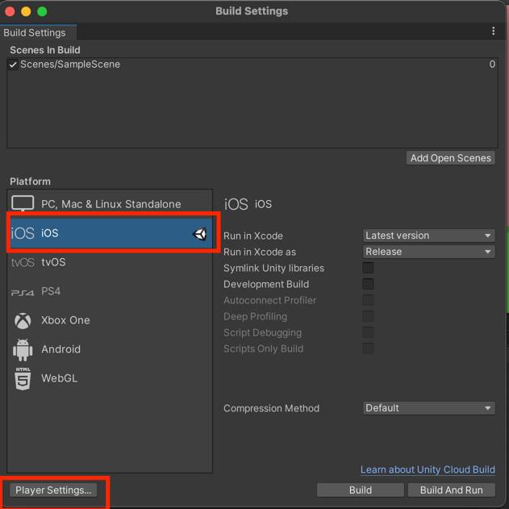
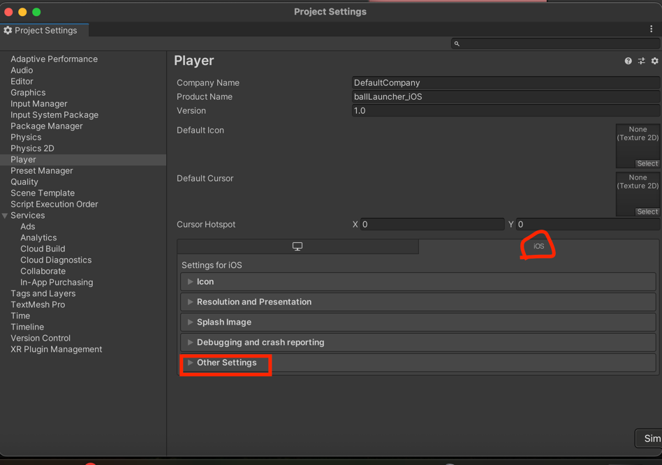
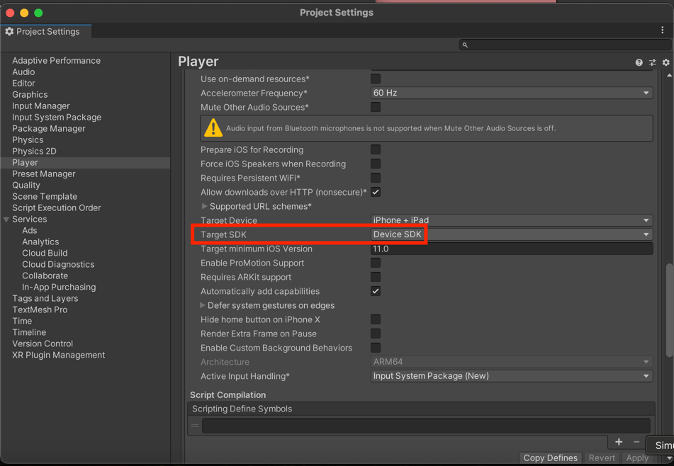
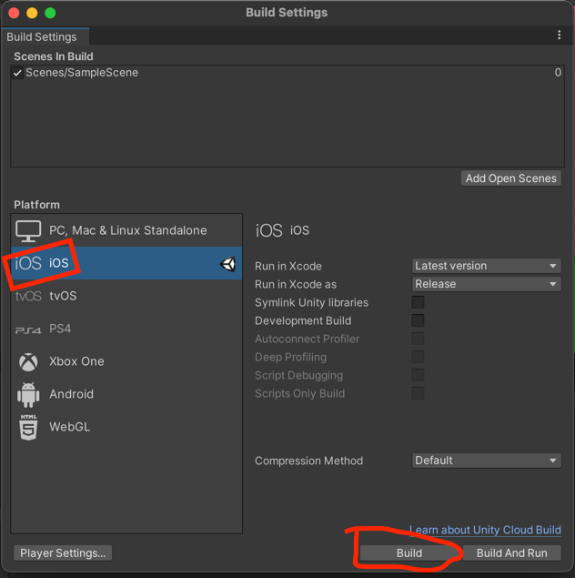
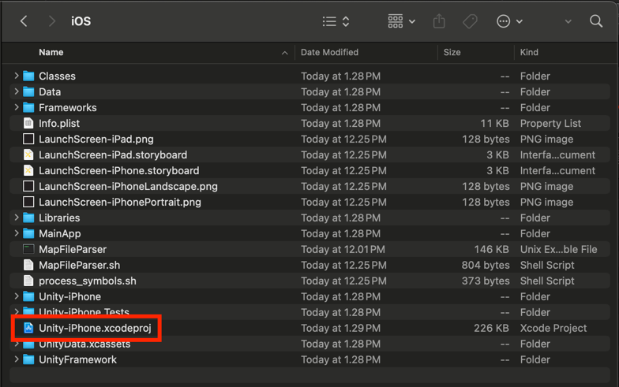
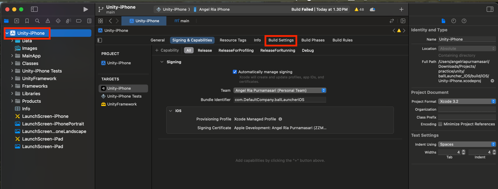
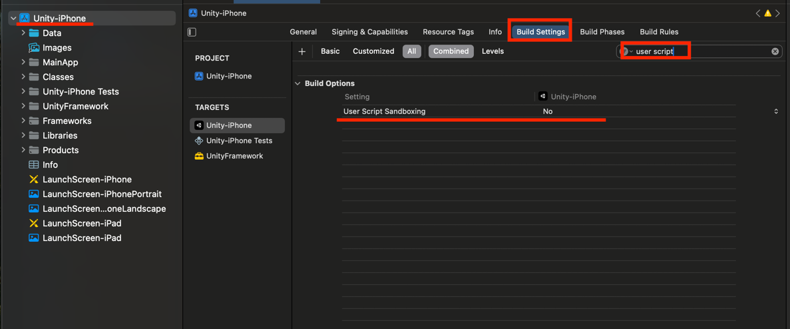
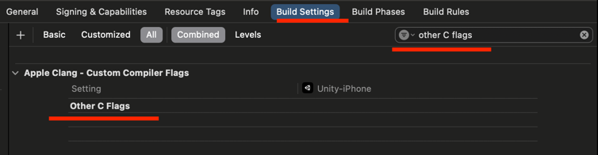

# Ball Launcher Game
<p align="center">
  
</p>

## Description

This project is a physics-based 2D Ball Launcher game built with Unity. It features a sling-shot mechanic using `SpringJoint2D`, custom despawn/respawn logic, and a multi-platform UI system for mobile and desktop play.

---
## Project Setup

Before you start, ensure you have the following installed:

* **Unity Hub**
* **Unity Editor 2020.2.0f1**
* **Git LFS** (Required for large library files)

> [⚠️!IMPORTANT]
> This project uses **Git LFS** to store large binary files. If you clone without Git LFS installed, your build files will be corrupted. Install it via `brew install git-lfs` (Mac) or `sudo apt install git-lfs` (Linux) and run `git lfs install` before cloning.

### 1. Clone the Repository

```zsh
git clone [https://github.com/your-username/ball-launcher.git](https://github.com/your-username/ball-launcher.git)
cd ball-launcher
```

### 2. .NET Environment

Unity scripts require the .NET SDK for IntelliSense. Check your version:

```zsh
dotnet --version
```

If not found, download it from [dotnet.microsoft.com](https://dotnet.microsoft.com/download).

### 3. Open with Unity

1. Open **Unity Hub** and click **Add**.
2. Select the `ball-launcher` folder.
3. Click the project to open.

> [⚠️ WARNING] <br>
> If you see a "Safe Mode" warning or compilation errors regarding `UnityEngine.InputSystem`, go to **Window > Package Manager**, search for **Input System**, and click **Install**. Unity will restart to enable the new back-ends.

## 🛠 Building for iOS (Mac Users)

Generating an iOS build requires local regeneration on a Mac. Do not use build folders committed from Windows.

---
### A. Configure Build Settings

#### 1. Go to File > Build Settings and select iOS.


#### 2.Click Player Settings... > Other Settings.



3. **Target SDK Selection:**


* Set to **Device SDK** for a physical iPhone.
* Set to **Simulator SDK** for the Xcode Simulator.
4. Click **Build** and choose a folder name (e.g., `Build_iOS`).

---
### B. Xcode Configuration
#### 1. Open the generated .xcodeproj file in Xcode
**ballLauncher_iOS > build > iOS**


#### 2. Select the Unity-iPhone project icon in the left sidebar. 


#### 3. Under Build Settings, search and apply these fixes:
* **Sandbox Fix:** Set User Script Sandboxing to No. 

* **Simulator Fix:** If using the Simulator, find Other C Flags and delete -mno-thumb.


---
### C. Launch
1. Select your target (Physical iPhone or a Simulator device) in the top toolbar. 
2. Press Cmd + R (Build and Run). 
3. Note: If using a real iPhone, you must go to Settings > General > VPN & Device Management on your phone to "Trust" the app before it will open.

----
## Test on TestFlight


## 🚀 Features

* **Sling-Shot Mechanics:** Interactive dragging using the new Unity Input System.
* **Dynamic Respawning:** Automated ball replacement using C# Coroutines.
* **Physics-Based Gameplay:** Utilizes `SpringJoint2D` and `Rigidbody2D`.
* **Cross-Platform UI:** Designed for both Mobile (Touch) and Desktop (Mouse).

---
